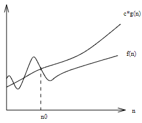
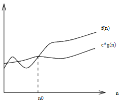
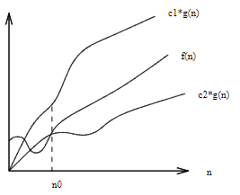

- #[[Landau Symbols]]
- It simplifies the analysis process by ignoring irrelevant levels of detail (like multiplicative constants)
- For example $$f(n)$$ and $$g(n)$$ behaves exactly in the same way. The multiplicative constant is irrelevant
- $$f(n) = 2n \quad \text{and} \quad g(n) = n$$
-
- ## [[Big Oh Notation]]
	- It represents the upper bound of a given function
	- It is used to represent the worst case scenario of an [[algorithm]]
	- $$f(n) = O(g(n))$$
	- It means that $$c \cdot g(n)$$ is an upper bound of $$f(n)$$
	- 
	-
-
- ## [[Big Omega Notation]]
	- It represents the lower bound of a given function
	- It is used to represent the best case scenario of an [[algorithm]]
	- $$f(n) = \Omega(g(n))$$
	- It means that $$c \cdot g(n)$$ is a lower bound of $$f(n)$$
	- 
	-
- ## [[Big Theta Notation]]
	- It represents the upper and lower bound of a given function
	- It is used to represent the average case scenario of an [[algorithm]]
	- $$f(n) = \Theta(g(n))$$
	- It means that $$c_1 \cdot g(n)$$ is an upper bound of $$f(n)$$ and $$c_2 \cdot g(n)$$ is a lower bound of $$f(n)$$
	- 
-
- ## Example:
	- Is $$2^{n + 1} = \Theta(2^n)$$?
	- #### Check upper bound (worst case scenario):
		- $$2^{n + 1} = O(2^n) \\ f(n) = 2^{n + 1} \quad g(n) = 2^n$$
		- By definition: $$f(n) = O(g(n))$$ if $$\exist c : f(n) \le c \cdot g(n)$$
		- Applying the definition to the given functions:
		- $$2^{n + 1} \le c \cdot 2^n \\ 2^n \cdot 2^1 \le c \cdot 2^n \\ c \ge 2$$
	- #### Check lower bound (best case scenario):
	- $$2^{n + 1} = \Omega(2^n) \\ f(n) = 2^{n + 1} \quad g(n) = 2^n$$
		- By definition: $$f(n) = \Omega(g(n))$$ if $$\exist c : f(n) \ge c \cdot g(n)$$
		- Applying the definition to the given functions:
		- $$2^{n + 1} \ge c \cdot 2^n \\ 2^n \cdot 2^1 \ge c \cdot 2^n \\ c \le 2$$
	- Both the conditions are verified. So $$2^{n + 1} = \Theta(2^n)$$ is true
	-
- ## Algebra of Asymptotic Symbols
	- ### Adding Functions
		- The sum of two functions is governed by the dominant one
		- $$O(f(n)) + O(g(n)) \rightarrow O(\max(f(n), g(n)) \\ \Omega(f(n)) + \Omega(g(n)) \rightarrow \Omega(\max(f(n), g(n)) \\ \Theta(f(n)) + \Theta(g(n)) \rightarrow \Theta(\max(f(n), g(n))$$
		- This can be useful to simplify expressions:
		- $$n^3 + n^2 + \frac{n}{2} + 1 = O(n^3)$$
	- ### Multiplying Functions
		- Multiplication is basically repeated addition
		- #### Multiplying by a constant
			- The constant is irrelevant, the other function will surely have a greater weight
			- $$\text{When} \; c > 0 \\O(c \cdot f(n)) \rightarrow O(f(n)) \\ \Omega(c \cdot f(n)) \rightarrow \Omega(f(n)) \\ \Theta(c \cdot f(n)) \rightarrow \Theta(f(n))$$
		- #### Multiplying by another growing function
			- Both the functions are important if they are growing
			- $$O(f(n)) \cdot O(g(n)) \rightarrow O(f(n) \cdot g(n)) \\ \Omega(f(n)) \cdot \Omega(g(n)) \rightarrow \Omega(f(n) \cdot g(n)) \\ \Theta(f(n)) \cdot \Theta(g(n)) \rightarrow \Theta(f(n) \cdot g(n))$$
			-