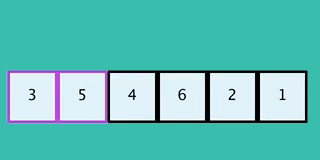

type:: [[algorithm]]
title:: Bubble Sort
algorithmic-family:: #[[sorting algorithm]] 
performance:: $$O(n^2)$$
difficulty:: #[[🟢 simple]]

-
- ## Notes
	- At the end of each iteration, the biggest number is pushed at the end of the array. It means that each iteration can be performed considering not the entire array, but the array from $$(0, previous Length - 1)$$
	-
	-
- ## Code
	- ```C
	  void bubble_sort(int arr[], int len) {
	    int i;
	  
	    for(; len > 1; len --) {  // Loops until len <= 1
	      for (i = 1; i < len; i ++) {  // Loops from 0 to len (which decrease at each outer iteration)
	        if (arr[i - 1] > arr[i]) swap(&arr[i - 1], &arr[i]);
	      }
	    }
	  }
	  ```
	-
- ## Visualization
	- 
	-
- ## Performance Analysis
	- This is the numerical series that represents the iterations for the bubble sort algorithm
	- $$S(n) = n + (n - 1) + (n - 2) + ... + 2 + 1$$
	- Using the [[Calcolo somma numeri fino a n]] we can describe it as:
	- $$S(n) = n + (n - 1) + (n - 2) + ... + 2 + 1 = \frac{n (n  + 1)}{2} = \frac{n^2 + n}{2} \\ S(n) = O(n^2 + n) = O(n^2)$$
	-
- ## Correctness Proof
	-
	-