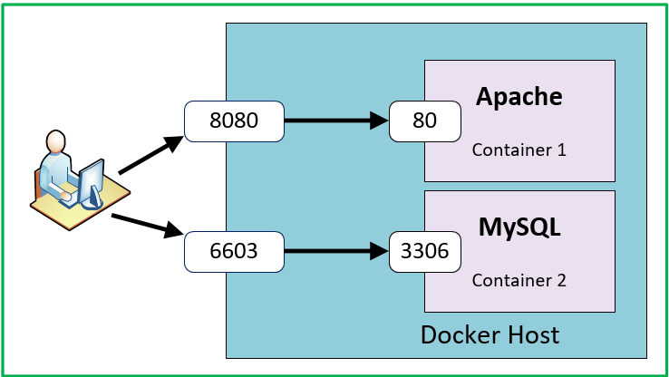

type:: [[video]] 
title:: Docker Crash Course for Absolute Beginners [NEW]
creator:: [[TechWorld with Nana]] 
topics:: #Docker #[[software development]] 
status:: #[[🪴 planted]] 
language:: [[🇬🇧 ENG]]
link:: [link](https://youtu.be/pg19Z8LL06w)

-
- ## What is [[Docker]]
	- It is an [[open source]] software that facilitates the development and deployment of applications
	- It is based upon the [[container]] concept
	-
- ## What problems [[Docker]] solves
	- ### Avoid local services installation
		- Before Docker, an entire team had to locally install each service needed for the application development
		- The problem is that installation may go wrong, or different components of the team may have different version of the same service (example: Alice has PostgreSQL version 1 installed, and John has PostgreSQL version 2 installed)
		- Using [[container]] will standardize this process. Each member of the team will download and start the isolated [[container]] of the service
		- Using this approach teams do not have to bother with local files configuration and installation
		- Using [[container]] you can have more version of the same service active without conflicts, which is very difficult to achive with local installation of the service itself
		-
	- ### Simplify the deployment
		- Before Docker, in order to deploy an application a team had to create an artifact containing the application source code and the config files for the installation
		- Than the artifact had to be delivered to the Ops team, which proceeded with the direct intallation and configuration of the application on the server [[OS]]
		- Using [[container]] solves the problem because it contains everything needed to run the application, the Ops team does not have to manually install on the server OS the dependencies, etc...
		- The Ops team has to install the [[Docker runtime]] on the server, then it will manage the containers as isolated lightweight enviroments
		-
- ## [[Virtual Machine]] vs [[Docker]]
	- Both technologies are used to virtualize the [[OS]]
	- [[Virtual Machine]] virtualizes the entire [[OS]]. On the phisical server is installed a [[Hypervisor]] that manages the communication and resource partitioning between each individual VM. Each VM has its own [[OS Kernel]]
	- [[Docker]] virtualizes only the [[OS Applications Layer]], which means that every [[container]] will share the same [[OS Kernel]]
	- 
	-
	- The booting process of a [[container]] is faster than the one of a [[Virtual Machine]] because it doesn't have to boot up an entire [[OS Kernel]] every time
	- The size of a [[container]] is less than the one of a [[Virtual Machine]] because it doesn't contain the [[OS Kernel]]
	- A [[container]] based upon [[Windows OS]] cannot be booted on a server based on a [[Linux]] [[OS Kernel]]. A [[Virtual Machine]] is totally hardware indipendent because it has its own [[OS Kernel]]
	- Using [[Docker Desktop]] is possible (but not suggested) to boot [[Linux]] based [[container]] on [[Windows OS]] or [[macOS]]
-
- ## Container vs Image
	- A Docker [[image]] is an immutable template that defines how a container will be realized
	- A Docker [[container]] is a running [[instance]] of an [[image]]
	- This is exactly like the difference between a [[class]] and an [[object]] (or an instance of the class)
	- You can run multiple [[container]] based on a single [[image]], maybe distributed on different machines
	-
- ## [[Docker Hub]]
	- It is a public registry for Docker [[image]]s
	- You can run [[container]] based upon on of those pre-built [[image]]s inside this large library
	- [[image]]s are [[versioned]], it means that every time a technology gets an update, a new [[image]] will developed
-
- ## How to create a [[container]]
	- The first thing is to pull an [[image]] from the registry using the docker pull command
	- ```Terminal
	  docker pull <image-name>:<version>
	  ```
	-
	- Than you should use the docker run command to start the container
	- ```Terminal
	  docker run <image-name>:<version>
	  ```
	-
	- Keep in mind that docker run creates every time a new [[container]]
	- To list each container (active or exited) you should use the following command:
	- ```Terminal
	  docker ps --all
	  // docker ps -a  (more concise)
	  ```
	-
	- For both commands are avaible a set of flags, part of which will be discussed more in this document
-
- ## Port Binding
	- When a [[container]] starts, it runs as an isolated enviroment
	- The service inside the container runs on a container port, but that port is not accessible from the localhost (or any other device)
	- To make it accessible you should bind the [[container]] port to a localhost port
	- 
	-
	- To execute the port binding you should add specific flags when starting a [[container]]
	- ```Terminal
	  docker run --detach --public <host-port>:<container-port> <image-name>:<version>
	  ```
	-
	- Or in a more concise way:
	- ```Terminal
	  docker run -d -p <host-port>:<container-port> <image-name>:<version>
	  // docker run -d -p 9000:80 nginx:1.23
	  ```
	-
	- Obviously only 1 container can be associated to a host port
	- You can't associate 2 or more containers to port 9000 for example
	- It is #[[good practice]] to associate to the container port the same localhost port (e.g. associate port 80 of the container with port 80 og the localhost)
	-
- ## Stop and Start [[container]]
	- As we mentioned earlier, docker run command creates every time a new [[container]]
	- In order to stop and start alredy created [[container]] we should you the stop and start commands
	- To stop a [[container]] use this command:
	- ```Terminal
	  docker stop <container-id>
	  // <container-id> is visible when we list the container through the docker ps -a command
	  ```
	-
	- To start a [[container]] use this command:
	- ```Terminal
	  docker start <container-id>
	  ```
	-
- ## Private docker [[image]]
	- Is possible to upload your own [[image]] inside an image repository provider (like AWS ERC, Google Cloud or [[Docker Hub]] itself)
	- Private [[image]] are not visible to the public
	-
- ## Defining a custom Docker [[image]]
	- In order to do that you should use something called [[Dockerfile]]
	-
- ## Building a custom Docker [[image]]
	- Once we defined a [[Dockerfile]] we can build the [[image]] just running a [[Docker]] command inside the terminal
	- ```Terminal
	  docker build --tag <app-name>:<version> <path-to-dockerfile>
	  ```
	-
	- Or in a more concise way:
	- ```Terminal
	  docker build -t <app-name>:<version> <path-to-dockerfile>
	  // docker build -t node-app:1.0 .  // "." because the dockerfile is the the working dir
	  ```
-