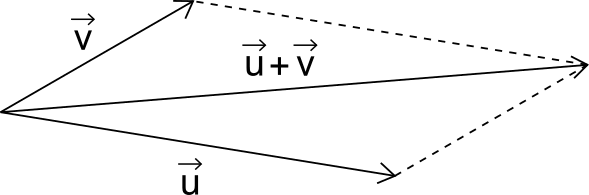

type:: [[course topic]]
title:: Spazi Vettoriali
main-course:: #[[Algebra Lineare e Geometria]] 
mental-map::
difficulty:: #[[🟡 medium]]

-
- ## Introduzione
	- Uno [[spazio vettoriale]] è una struttura algebrica definita a partire da un [[insieme]] di [[vettori]] , da un [[campo]] di [[scalari]] e dalle operazioni binarie [[Operazione binaria somma]], [[Operazione binaria prodotto]] che devono soddisfare delle specifiche proprietà
		- $$\mathbb{R}^n := \mathbb{R} \times ... \times \mathbb{R} = \left\{\left[\begin{matrix} x_1 \\ \vdots \\ x_n \end{matrix}\right] : x_1, ..., x_n \in \mathbb{R}\right\}$$
		-
- ## Somma tra [[vettori]]
	- La somma tra vettori avviene in questo modo:
	- $$\left[\begin{matrix} x_1 \\ \vdots \\ x_n \end{matrix}\right] + \left[\begin{matrix} y_1 \\ \vdots \\ y_n \end{matrix}\right] = \left[\begin{matrix} x_1 + y_1 \\ \vdots \\ x_n + y_n \end{matrix}\right]$$
	- Graficamente la somma viene rappresentata tramite la [[regola del parallelogramma]]:
	-
	- 
	-
	-
- ## Prodotto tra uno [[scalare]] e un [[vettore]]
	- Il prodotto tra uno scalare e un vettore avviene in questo modo:
	- $$\alpha \cdot \left[\begin{matrix} x_1 \\ \vdots \\ x_n \end{matrix}\right] = \left[\begin{matrix} \alpha x_1 \\ \vdots \\ \alpha x_n \end{matrix}\right]$$
	-
- ## Definizione spazio vettoriale
-
-
-
-
-
- ## Dimensione di uno spazio vettoriale
	- Sia $$V$$ [[spazio vettoriale]]. Si dice una [[base]] di $$V$$ un insieme di [[vettori]] che generano $$V$$ ed è al contempo [[linearmente indipendente]]
	-