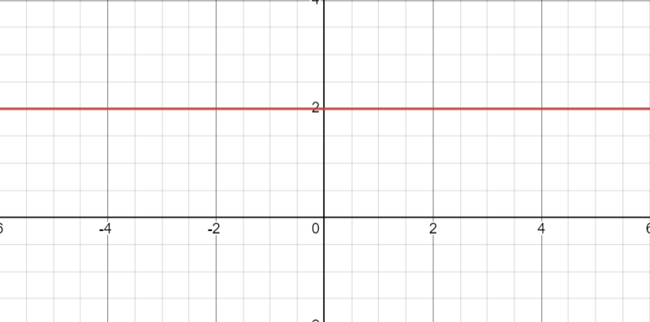

- A function that, no matter which value of $$x$$ will be inserted, returns the same value
- $$f(x) = k$$
- 
-
- When referring to [[software development]], a constant time function is a function that execute the same number of steps despite the input values.
- Using [[Big Oh Notation]] a constant time function is defined as a $$O(1)$$
- An example of a constant time function in [[programming language]] is:
- ```Python
  def square_first_element(values: List[int]) -> int:
    return values[0] ** 2
  ```