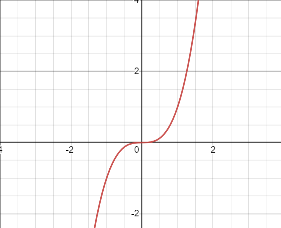

- A function that grows depending on the cubic value of x
- $$f(x) = x^3$$
- 
-
- When referring to [[software development]], an example is an algorithm with 3 nested loops that print each triple of items