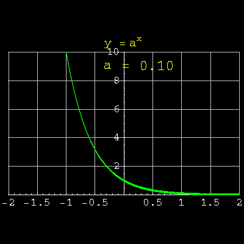

- A function that increase or decrease depending upon the value of $$c$$
- $$f(x) = c^x = \begin{cases} \text{grows} & \text{if} \;c > 1 \\ \text{declines} & \text{if} \; 0<c<1 \end{cases}$$
- {:height 408, :width 400}