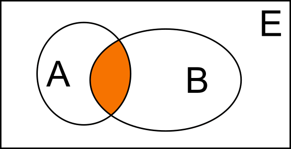

- Nell'ambito degli [[Insiemi]] viene usato per indicare l'intersezione di $$n$$ insiemi
- $$A \cap B$$
- L'intersezione gode della [[proprietà commutativa]] [[proprietà associativa]] e [[proprietà distributiva]]
- Graficamente si presenta in questo modo:
- 