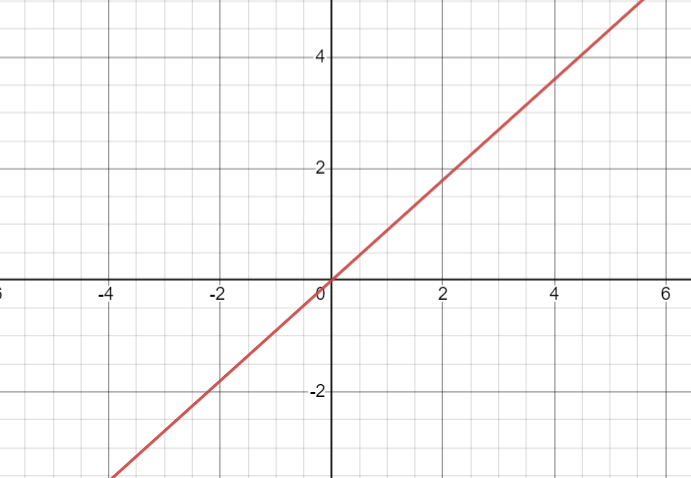

- A function that increase or decrease linearly depending on the value of $$x$$
- $$f(x) = mx + q$$
- {:height 404, :width 573}
-
- When referring to [[software development]], an example of linear function is a function that prints a list of values (because the time required is linearly dependent to the number of elements in the list):
- ```Python
  def print_list(values: List[int]) -> None:
    for num in values:
      print(f"[{num}] ")
  ```