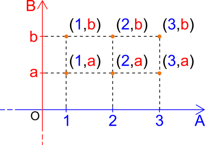

- Nell'ambito degli [[Insiemi]] viene usato per indicare il prodotto cartesiano tra $$n$$ insiemi
- $$A \times B = \left\{(a, b) : a \in A \land b \in B\right\}$$
- Graficamente si presenta in questo modo:
- 