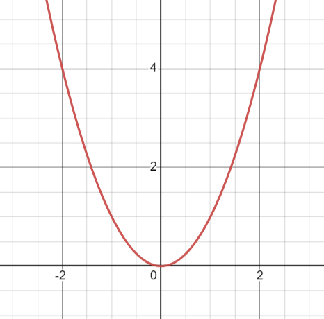

- A function that grows depending on the quadratic value of $$x$$
- $$f(x) = x^2$$
- {:height 468, :width 466}
-
- When referring to [[software development]], an example of quadratic function is an algorithm that prints a matrix:
- ```Python
  def quadratic_function(items: List[int]) -> None:
    for item in items:
      for item2 in items:
        print(f"{item}, {item2}")
  ```