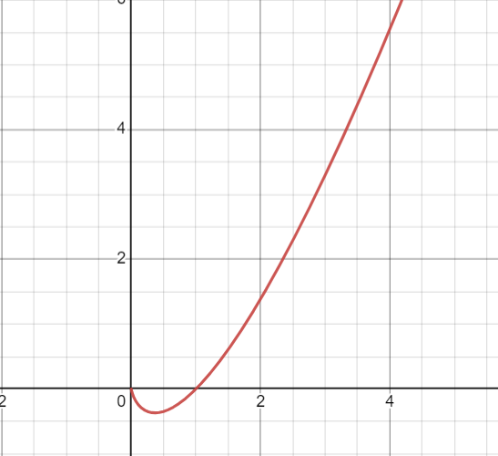

- A function that increase or decrease just a little faster than [[linear functions]]
- $$f(x) = x\ln(x)$$
- 
-
- When referring to [[software development]], an example of superlinear function is [[quicksort]] and [[mergesort]] algorithms