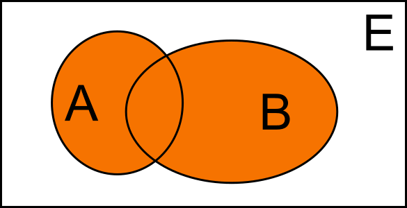

- Nell'ambito degli [[Insiemi]] viene usato per indicare l'unione di $$n$$ insiemi
- $$A \cup B$$
- L'unione gode della [[proprietà commutativa]] [[proprietà associativa]] e [[proprietà distributiva]]
- Graficamente si rappresenta in questo modo:
- 